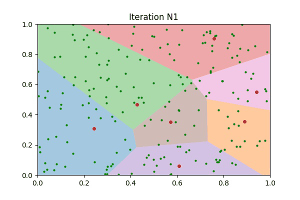

## K-Means Clustering Implementation

### Algorithm

Let X={x1,x2⋯xn} X={x1,x2⋯xn} be the set of data points

Let V={v1,v2⋯vc} V={v1,v2⋯vc} be the set of cluster centers

1. Randomly select 'c' cluster centers
2. Compute the distance between each data point and each cluster center
3. Assign each data point to its nearest cluster
4. Recompute the new cluster centers based on the points assigned to it.
5. Recompute the distance between each data point and the new cluster centers
6. If no data point was reassigned then stop, otherwise repeat from Step 3

The process is saved in a gif